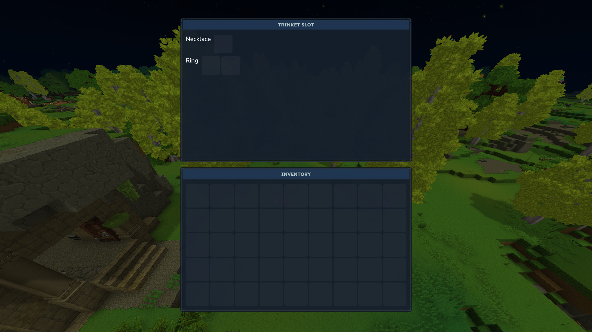

# HyTrinkets


## Into
HyTrinkets is a plugin that introduces a Trinket Slot system into Hytale.  
This plugin does not add any new items into the game. Instead, it focuses purely on providing a flexible slot-based system that allows developers to define and manage their own trinket items.  


## Dev Guide
#### 1. Creating a Trinket
Creating a Trinket Slot allows you to define custom equipment slots where trinket items can be placed.  
Each slot can have its own limit, determining how many items a player can equip in that slot.

For example:
```  
TrinketRegistry.RegisterSlot("Ring", 2);  
TrinketRegistry.RegisterSlot("Necklace", 1);  
```  

This will create:

- A **Ring** slot with 2 available spaces
- A **Necklace** slot with 1 available space

#### 2. Registering a Trinket
Registering a Trinket defines which items can be equipped in specific trinket slots.  
This step links your custom item to a slot type so the system knows where it can be used.

For example:

    TrinketRegistry.RegisterItem("Necklace", "ResurrectionCollar");
Or with a class reference:

    TrinketRegistry.registerItem("ring", "UndeadRing", UndeadRing.class);
These examples register items so they can be equipped in their respective slots:
-   **ResurrectionCollar** → Necklace slot
-   **UndeadRing** → Ring slot
#### 3. Creating a Trinket Effect
To define custom behavior for a trinket, you need to create a class that extends `TrinketItem`.  
This allows you to control what happens when a player equips or unequips the item.
For example:

    class UndeadRing extends TrinketCallback {
	    @Override
	    protected boolean onEquip(Player player) {
	        return true; // Allow the item to be equipped
	    }

	    @Override
	    protected boolean onUnequip(Player player) {
	        return true; // Allow the item to be unequipped
	    }
    }

-   `onEquip` is called when the player tries to equip the item
-   `onUnequip` is called when the player tries to remove the item
-   Returning `false` will prevent the action

----
# Example Plugin
https://github.com/Novitnit/HyTrinkets-Item